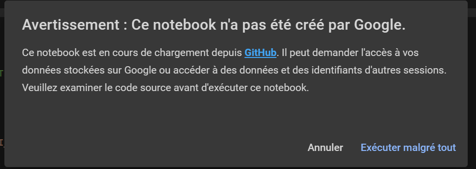
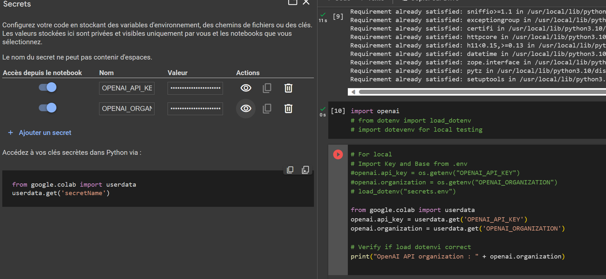
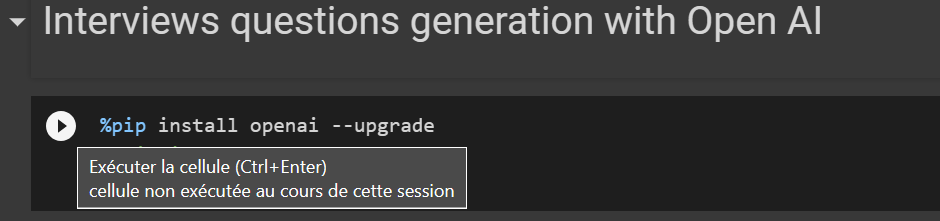
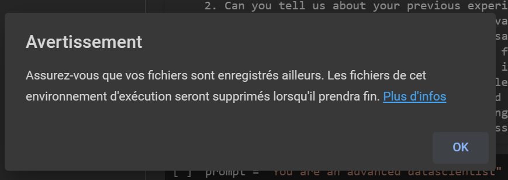
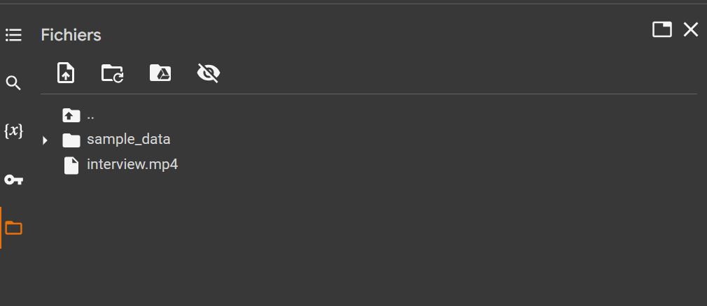

<p align="center">Preparing for the course 
(required to be completed <u><b>before</b></u> session 1)</p>

>Please follows these instructions to prepare for your first session of the course.


# INSEAD Course - Gen AI App & Demo - 101

>*In this course, you will discover and test technologies AI/LLM for Gen AI ( aka generative AI)

We'll use  OpenAI Service and keys to access/use models with the use of apis and [Google Collab](https://colab.research.google.com/)  with python Language 

> [IMPORTANT]
> if you want to share this course use this link [aka.ms/InseadGenAI](https://aka.ms/InseadGenAI)


> [NOTE]
> you can use theses notebook in local/computer : with Visual studio code or use Conda to launch Jupyter notebook

## First steps 

### OpenAi Account
1. **Visit the OpenAI website**: Go to [https://www.openai.com/](https://www.openai.com/)

2. **Create an account**: Click on the 'Sign Up' button on the top right corner of the website. Fill in your details and follow the prompts to create your account.

3. **Verify your email**: Check your email for a verification link from OpenAI. Click on the link to verify your account.

4. **Log in to your account**: After verifying your email, log in to your account using your credentials.

#### Discover Sandbox Gpts /Chatbot

To discover the concept of [prompt engineering](./pages/prompts.md) , [models](./pages/models.md) and [RAG - retrieval Augmented Generation](https://learn.microsoft.com/en-us/azure/search/retrieval-augmented-generation-overview) you could visit and test the sandbox Gpts ( very new announcement ) for testing and play with a chatbot interface without coding.

Go to [https://platform.openai.com/playground](https://platform.openai.com/playground)


Selection your model, we will select gpt-4


If you want to know differences between LLM model for the choice , you can deep dive  [on this link](https://platform.openai.com/docs/models/overview)

This interface will be shown after you have created correctly your chabot


You can also read this [page for understanding basic in prompt engineering for prompt system](./pages/prompts.md)

Resource links:
- Sandbox / Playground Open AI [https://platform.openai.com/playground](https://platform.openai.com/playground)
- Documentation Assistants [https://platform.openai.com/docs/assistants/overview](https://platform.openai.com/docs/assistants/overview)
- Api With open AI[https://platform.openai.com/docs/api-reference](https://platform.openai.com/docs/api-reference)


## Step-by-step guide to create a user login on OpenAI and prepare your organization and key


5. **Access the API dashboard**: Once logged in, navigate to the API dashboard named Api Keys. This is where you'll find or you have to create your API key.

6. **Create a new API key**: If you don't already have an API key, you can create a new one by clicking on the 'Create new API key' button.


You can select the name you want

You will have this kind of view after create (several keys) 

> [IMPORTANT]
> Don't forget every usage of a model with OpenAI has a direct impact on bill by usage  (check this link to understand the difference in costing / models)[https://openai.com/pricing]

7. **Copy your API key**: After creating your API key, make sure to copy it and store it somewhere safe. This key is used to authenticate your requests to the OpenAI API.

8. **Set up your organization**: In the API dashboard, you can also set up your organization. This involves adding other users to your organization and managing their access levels.


**Remember**, keep your Open AI API key secure and **do not share** it with anyone. It's also a good practice to regularly rotate your API keys, or create a new one by application or usage.


### Google account & Colab Notebook

In order to simplify the problem of python version and different installation we will use this platform **notebook Colab** in order to increase the velocity for access 

- Have a google Gmail Account , if not [create a new one](https://support.google.com/mail/answer/56256?hl=en-EN)

We will use the colab notebook :

- Go to [https://colab.research.google.com/](https://colab.research.google.com/) and follow these links to have the latest notebook - 3 usescaes

- Use theses Google Collab to import the diffrent notebook :
    - Interview questions generation [https://aka.ms/inseadGenAi-1](https://aka.ms/inseadGenAI-1)
    - Web article generation [https://aka.ms/inseadGenAi-2](https://aka.ms/inseadGenAI-2)
    - Extract audio with whisper and process the text [https://aka.ms/inseadGenAi-3](https://aka.ms/inseadGenAi-3)


You may encounter on warning pop - click ok:



When the notebook is correctly import in your personal collab, you have to first import your secrets

- Add your secrets ( Key and organization imported form OpenAI **sk-XXX** and **org-xxxxxx** ) in the left panel in Google Collab


Create one at a time the variable secret :

- Copy/paste this name : ````OPENAI_API_KEY```` 
-  Copy paste your sk-key inside the right input 
- Click on the left blue button to render the secret available in your notebook

> Next secret for organization

- Copy/paste this name : ````OPENAI_ORGANIZATION````
- Copy paste your org-key inside the right input 
- Click on left blue button to render the secret available in your notebook


Don't be afraid with **python** you will have help 
 :smiling_face_with_three_hearts:

 For a notebook you have to click on every small play inside the notebook

 


For the last Notebook, you could import you proper mp4 file video or audio, follow this:
- Click on the folder button on the left
- Import your file inside the current path, say yes to the pop up warning, you have to respect the naming or you will have to change the name in the 3 notebook






### Reference links 

- [AI Term Glossary](./pages/glossary.md)
- [ Models ](./pages/models.md)
- [ Prompt Engineering](./pages/prompts.md)


### Azure and OpenAI: A Partnership for Large Language Models

Microsoft Azure and OpenAI have formed a strategic partnership to develop and deploy large language models (LLMs) like GPT-3. Here are some key points about this partnership:

1. **Shared Goals**: Both Microsoft and OpenAI aim to democratize AI and its benefits. They are committed to ensuring that artificial general intelligence (AGI) benefits all of humanity.

2. **Azure Infrastructure**: OpenAI utilizes Microsoft Azure's robust and scalable infrastructure to train and deploy their large language models. Azure's advanced capabilities in compute, storage, and networking make it a suitable platform for handling the intensive requirements of training LLMs.

3. **Exclusive Licensing**: Microsoft has an exclusive license to GPT-3, one of OpenAI's most powerful LLMs. This means that Microsoft can integrate GPT-3 into its products and services, providing its customers with the benefits of this advanced AI model.

4. **Future Collaborations**: The partnership also involves future collaborations on AI safety, policy, and standards research. This is to ensure that the deployment of AGI is done in a manner that is safe and beneficial to society.

This partnership represents a significant step forward in the development and deployment of large language models, with potential applications in a wide range of industries and sectors.

[If you want to discover more information in Azure Open AI services](https://learn.microsoft.com/en-us/azure/ai-services/openai/overview)

---
**Olivier Mertens**  
Developer Audience 
Azure Open AI Service  
@Microsoft

[GitHub](https://github.com/olivMertens) | [LinkedIn](https://linkedin.com/in/mertensolivier)