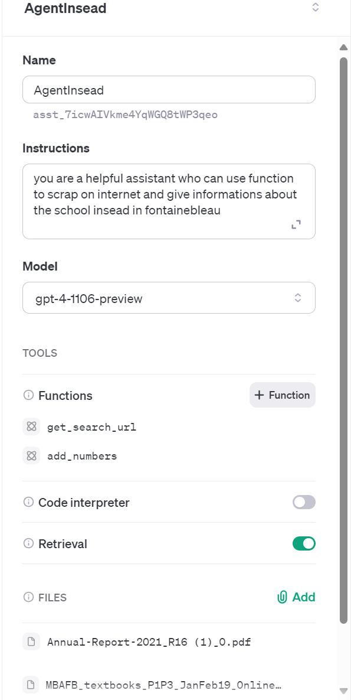

   # INSEAD MBA Course "Building genAI Products and Business"
   **T. Evgeniou, Professor INSEAD** [GitHub](https://github.com/tevgeniou) | [LinkedIn](https://www.linkedin.com/in/theodoros-evgeniou-5397b/)

<b><it>The material for session 1 was developed by **Olivier Mertens**, Developer Audience, Azure Open AI Service, @Microsoft [GitHub](https://github.com/olivMertens) | [LinkedIn](https://linkedin.com/in/mertensolivier) </b></it>
</br>
</br>

In the first session, we will learn about some Gen AI tools that we will use for product prototyping during the class.

We'll use  OpenAI Service and keys to access/use models with the use of apis and [Google Collab](https://colab.research.google.com/) (browser based) for some python coding. 

> **[NOTE]**
> You can also use all notebooks in a local/your computer: with Visual studio code or using Conda to launch Jupyter notebook
> You have to install this sofware to use in in local

Summary of the session:
- [First steps](#first-steps)
- [Create a user login on OpenAI and prepare your organization and keys](#create-a-user-login-on-openai-and-prepare-your-organization-and-keys)
- [Exploring genAI: Three Examples](#exploring-genai-three-examples)
- [Gen AI in real world](#gen-ai-in-real-world) 
- [Reference links](#reference-links)


## First steps 

### OpenAI Account

1. **Go to the OpenAI website**:  [https://www.openai.com/](https://www.openai.com/)

2. **Create an account**: Click on the 'Sign Up' button on the top right corner of the website. Fill in your details and follow the steps to create your account.

3. **Verify your email**: Check your email for a verification link from OpenAI. Click on the link to verify your account.

4. **Log in to your account**: After verifying your email, log in to your account using your credentials.

#### Discover Sandbox GPTs 

To experiment with the key concepts of [prompt engineering](./pages/prompts.md), [models](./pages/models.md) and [RAG - retrieval Augmented Generation](https://learn.microsoft.com/en-us/azure/search/retrieval-augmented-generation-overview) you could visit and test the sandbox GPTs (just announced by OpenAI in November 2023) to play with a chatbot interface without the need to code ("No Code" environment). To do so, you can go to [https://platform.openai.com/playground](https://platform.openai.com/playground)


Select your model (e.g., we can select gpt-4 or earlier - and less costly - ones like gpt-3.5-turbo)


If you want to know about differences between the available LLM models, you can deep dive at [this link](https://platform.openai.com/docs/models/overview)

This interface will be shown after you have correctly created your chatbot


You can also read this for some more background [on basic prompt engineering](./pages/prompts.md)

Other resources:
- Sandbox / Playground Open AI [https://platform.openai.com/playground](https://platform.openai.com/playground)
- Documentation Assistants [https://platform.openai.com/docs/assistants/overview](https://platform.openai.com/docs/assistants/overview)
- API With openAI [https://platform.openai.com/docs/api-reference](https://platform.openai.com/docs/api-reference)


## Create a user login on OpenAI and prepare your organization and keys


1. **Access the API dashboard**: Once logged in, navigate to the API dashboard named Api Keys. 

2. **Create a new API key**: If you don't already have an API key, you can create a new one by clicking on the 'Create new API key' button.


You can select the name you want

You will have this kind of view after creating a key (or several keys) 
<br>
<br>

> **IMPORTANT**
> Don't forget every usage of a model with OpenAI will **cost**  something! ( and the price depends of your chosen model)
> check this link to understand the difference in pricing / models)[https://openai.com/pricing]

7. **Copy your API key**: After creating your API key, make sure to copy it and store it <b>somewhere safe</b>. This key is used to authenticate your requests to the OpenAI API. <b>Whoever has access to it will be charging your account when using it!</b>

8. **Set up your organization**: In the API dashboard, you can also set up your organization if needed. This involves adding other users to your organization and managing their access levels.


**Remember**, keep your Open AI API key secure and **do not share** it with anyone. It's also a good practice to regularly rotate your API keys, or create a new one for each application or usage.


### Google account & Collab Notebook

In order to simplify potential issues with different python versions or different operating systems and problematic install on your personal computer.

We will use **notebook Collab** for this course. You can of course also work on your computer if you choose to, using for example [Anaconda](https://www.anaconda.com/) (beyond the course).

- You need to have a Google Gmail Account. If not [create a new one](https://support.google.com/mail/answer/56256?hl=en-EN)

## Exploring genAI: Three Examples

We will use these three colab notebooks as starting examples. Go to [https://colab.research.google.com/](https://colab.research.google.com/) and follow these links to have the latest notebooks for course session 1:
<br>
- Interview questions generation [https://aka.ms/inseadGenAi-1](https://aka.ms/inseadGenAI-1)
- Web article generation [https://aka.ms/inseadGenAi-2](https://aka.ms/inseadGenAI-2)
- (This one will require some more steps, see below) Extract audio with whisper and process the text [https://aka.ms/inseadGenAi-3](https://aka.ms/inseadGenAi-3)

We will be adding more over time (as you will notice). 

You may encounter warning pop-up windows - click **ok** or **execute** to continue.


When a notebook is correctly imported in your personal collab, you have to first import your __secrets__ credentials.

- Add your secrets (Key and organization imported form OpenAI **sk-XXX** and **org-xxxxxx**) in the left panel in Google Collab


Create a variable secret one at a time:

- Copy/paste this name: ````OPENAI_API_KEY```` 
- Copy paste your sk-key inside the right input named value
- Click on the left blue button to render the secret available in your notebook

> Next, if needed (you do **not** need to do this for the course), you can also add a __secret__ key and value for an organization:

- Copy/paste this name: ````OPENAI_ORGANIZATION````
- Copy paste your org-key inside the right input input named value
- Click on left blue button to render the secret available in your notebook

</br>

To use/run a notebook you have to click on every small "play button" inside the notebook **on the left** of the code chunk.

 

>**[Note]** The three example notebooks the very first "code chunk" (that installs packages) may take a few seconds to run and will be generating some messages. Simply wait till it completes running. 

</br> 

For the third (audio analysis) Notebook, you can import you own mp4 file video or audio to analyse. To do so:
- Click on the folder button on the left
- Import your file inside the current path - click yes to the pop up warning. Note that you have to respect the file naming ("interview.mp4") or else you will have to change the name in the notebook itself in the line *inputFile = "/content/interview.mp4"*

</br>


</br>


## You are now ready to explore! Have Fun!

__Don't be afraid of **python** you will also get help!__

 :smiling_face_with_three_hearts:

## Gpts / RAG / functions

So you have now seen some examples of what you can do with Gen AI. You can now try to explore the [OpenAI API GPTS actions ](https://platform.openai.com/docs/actions/introduction) to see what else is possible.

What is it about ? Gpt's custom can give a chabot with some capabilities to interact with users and you can open it to the world, customize the user experience, add some files for custom the grounded experience

- Has custom instructions which determine the way the GPT interacts with users
- Includes tools like browsing, DALL·E, and Code Interpreter
- Comes with preset starter prompts for new and returning users
- Has custom actions which allow you to connect the GPT to APIs

### RAG ( AKA retrieval augmented generation)

a possibility to grounded with verified data ( from pdf files , csv, html, etc) to give a more accurate answer to the user ask
or with a database vector ( contains embeddings of the data) to give a more accurate answer to the user ask

### Functions

Functions it's first to give model a possibility to determine if a function is relevant to the user ask for resolve
If you want to use the GPTs functions, you can go to the [Cookbook for functions](https://cookbook.openai.com/examples/how_to_call_functions_with_chat_models) to see what else is possible.
Or take a look to this post in forum open AI who explain clearly [how it works](https://community.openai.com/t/how-does-function-calling-actually-work-for-the-assistants-api/641440/11) 
But the function called an api or a business process to resolve the user ask

### Agents / Assistants

It's next iteration with thread / messages and tools ( AKA Functions) available ( 128 if you want it) with possibilitis to add RAG or code interpreter to permit a "agent" with prompt system or persona to have the autonomy to called by "himself" the function/tools to resolve the user ask
Take a look on this documentation repository about this[ Azure Assistants](https://github.com/olivMertens/AzureOpenAiAssistants))




## Gen AI Products in Real World (Optional)

Now you have an idea of what one can do with Gen AI - one can use it for many different applications. However, going from a Python Notebook "demo" to an actual product requires some engineering. The tools needed are in some ways like lego blocks: one can combine them to create their own solution.

Let's now see how to build actual gen AI products! Let's start with a really simple use case. The idea of the example here is to insert some python code inside a file of an existing web application to be able to use it as part of that application.

We use python  for simplicity, but one can explore other languages like dotnet, java or others. 

> Note: Some software architecture decisions could be **critical** in your launch of a product. Understanding the choices and trade offs is very important, but not the purpose of this course.

We will use the lastet developement (in beta version, as of February 2024) from OpenAI: the "Assistants". You can [follow these video guides to create a simple chatbot with OpenAI and Azure ](https://www.youtube.com/playlist?list=PL5lwDBUC0ag6_dGZst5m3G72ewfwXLcXV)

You can also follow these steps ("for a beginner, not a developper") to 
[implement your code inside an already existing app](./pages/appstarter.md)

Some example assistants can be found [here](https://github.com/Azure/AI-in-a-Box/tree/main/gen-ai/Assistants/api-in-a-box)

### Reference links App starter

- [ Starters use case: AI in a box](https://github.com/Azure/AI-in-a-Box/tree/main?tab=readme-ov-file)
- [ Sample App With RAG](https://aka.ms/ragchat)
- [ Call center Claim AI phone bot](https://github.com/clemlesne/claim-ai-phone-bot)
- [ Youtube - Github OpenAi RAG App on Azure](https://www.youtube.com/watch?v=j8i-OM5kwiY)
- [ Evaluating a RAG Chat App](https://github.com/Azure-Samples/ai-rag-chat-evaluator)


## Reference links 

- [ AI Term Glossary](./pages/glossary.md)
- [ Models ](./pages/models.md)
- [ Azure Assistants](https://github.com/olivMertens/AzureOpenAiAssistants)
- [ Generative AI Guide](https://github.com/aishwaryanr/awesome-generative-ai-guide)
- [ RAG Ai document intelligence](https://learn.microsoft.com/en-us/azure/ai-services/document-intelligence/concept-retrieval-augumented-generation?view=doc-intel-4.0.0#semantic-chunking-with-document-intelligence-layout-model)
- [ AI Chat App Hack](https://www.youtube.com/playlist?list=PL5lwDBUC0ag6_dGZst5m3G72ewfwXLcXV)
- [ Prompt Engineering](./pages/prompts.md)
- [ How a transformer works](https://www.youtube.com/watch?v=C6ZszXYPDDw)


[More information on Azure Open AI services can be found here](https://learn.microsoft.com/en-us/azure/ai-services/openai/overview)
