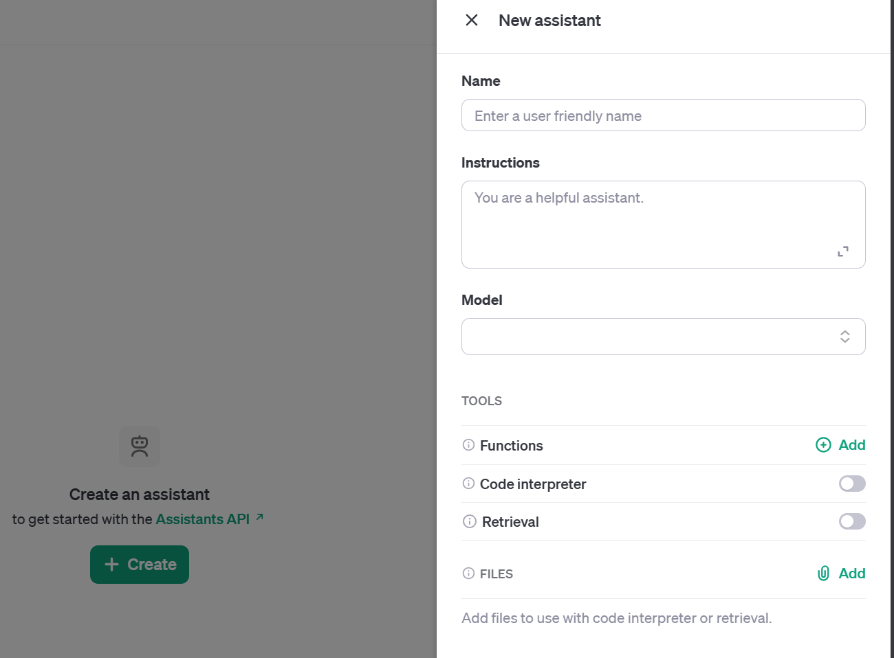
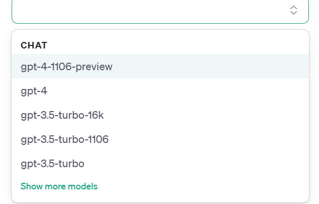
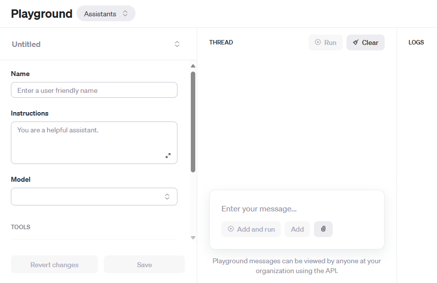
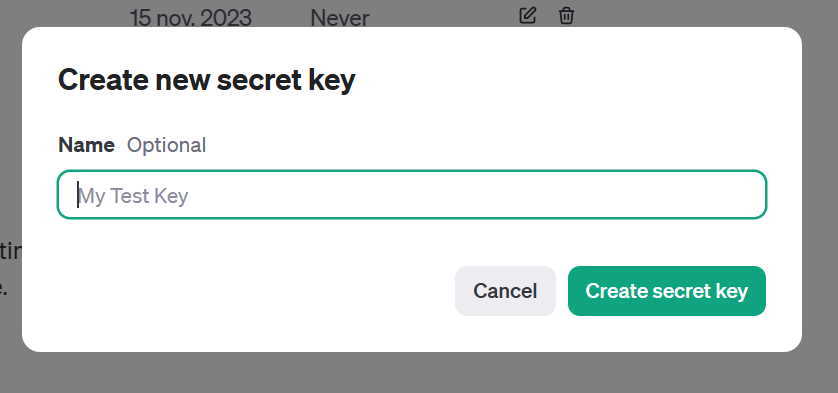
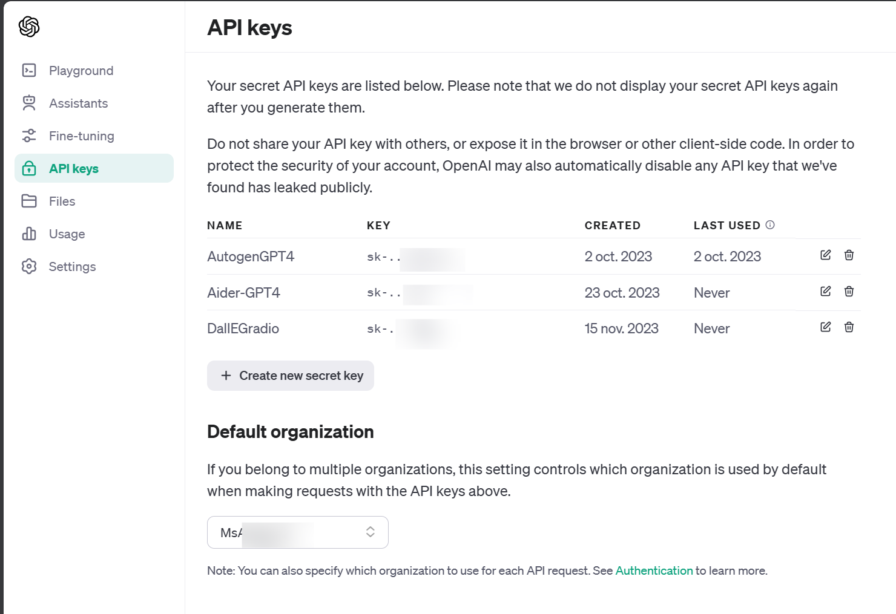
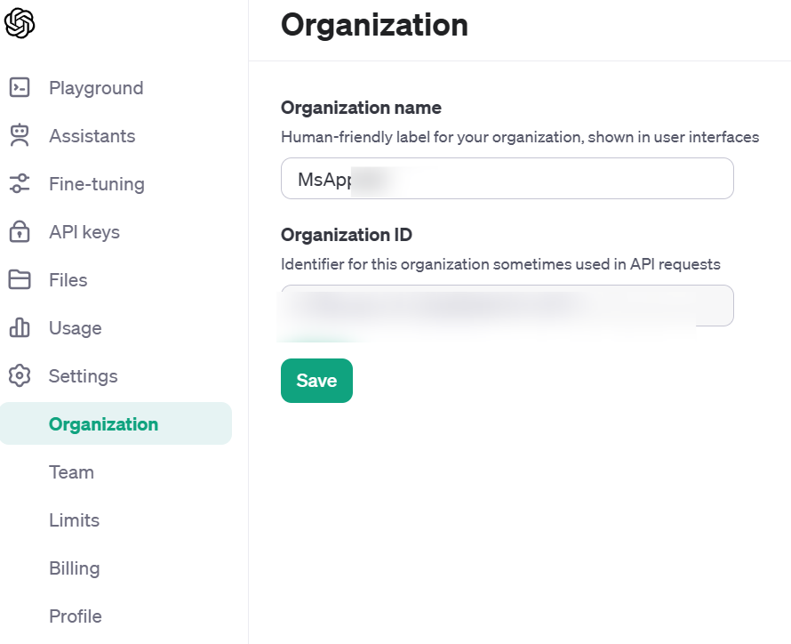

# INSEAD Course - Gen AI App & Demo - 101

**For this course, for discovering the technologies AI/LLM and Gen AI**
We we'll use only the access and login with OpenAI Service

## First steps 
### Google accound & Collab Notebook

In order to simplify the problem of python version and different installation we will use this platform **notebook Colab** in order to increase the velocity for access 

- Have a google Gmail Account , if not [create a new one](https://support.google.com/mail/answer/56256?hl=en-EN)

We will use the colab notebook in google

- Go to [https://colab.research.google.com/](https://colab.research.google.com/) or follow thi links to have the latest notebook for the course  (imported from github repository course)

- Use this Google Collab [https://aka.ms/InseadGenAI](https://aka.ms/InseadGenAI)

- Add your secrets ( Key and organization from Open AI SK-XXX and org-xxxxxx ) in the left panel in Google Collab

So you will have to use python language , don't be afraid you will have help !! :smiling_face_with_three_hearts: ( Gen Ai Help also )

### OpenAi Account
1. **Visit the OpenAI website**: Go to [https://www.openai.com/](https://www.openai.com/)

2. **Create an account**: Click on the 'Sign Up' button on the top right corner of the website. Fill in your details and follow the prompts to create your account.

3. **Verify your email**: Check your email for a verification link from OpenAI. Click on the link to verify your account.

4. **Log in to your account**: After verifying your email, log in to your account using your credentials.

#### Discover Sandbox Gpts /Chatbot

To easily discover the concept of prompt engineering , models and [RAG acronym for retrieval Augmented Generation](https://learn.microsoft.com/en-us/azure/search/retrieval-augmented-generation-overview) you could visit and test the sandbox Gpts ( very new announcement ) for testing and play with a chatbot interface already avaiable for testing in a safe platform

Go to [https://platform.openai.com/playground](https://platform.openai.com/playground)

Selection your model, we will select gpt-4

If you want to know differences between  LLM model for the choice , you can deep dive  [here](https://platform.openai.com/docs/models/overview)

This interface will be shown after you have created correctly your chabot

You can also read this [page for understanding basic for prompt engineering / prompt system](PROMPTS.md)

### Reference links 

- Sandbox / Playground Open AI [https://platform.openai.com/playground](https://platform.openai.com/playground)
- Documentation Assistants [https://platform.openai.com/docs/assistants/overview](https://platform.openai.com/docs/assistants/overview)
- Apis open AI[https://platform.openai.com/docs/api-reference](https://platform.openai.com/docs/api-reference)

## Step-by-step guide to create a user login on OpenAI and prepare your organization and key

5. **Access the API dashboard**: Once logged in, navigate to the API dashboard named Api Keys. This is where you'll find or you have to create your API key.

6. **Create a new API key**: If you don't already have an API key, you can create a new one by clicking on the 'Create new API key' button.

You can select the name you want

You will have this kind of view after create (several keys) 

7. **Copy your API key**: After creating your API key, make sure to copy it and store it somewhere safe. This key is used to authenticate your requests to the OpenAI API.

8. **Set up your organization**: In the API dashboard, you can also set up your organization. This involves adding other users to your organization and managing their access levels.

**Remember**, keep your API key secure and do not share it with anyone. It's also a good practice to regularly rotate your API keys, or create a new one by application or usage.

### Glossary of AI Terms

1. **LLM / MODELS**: Stands for Large Language Models. These are AI models trained on a large amount of text data. They can generate human-like text based on the input they're given.
You can read this page [MODELS](./MODELS.md)

2. **Prompt engineering**: The practice of crafting effective prompts to get the desired output from a language model. It's a crucial part of working with models like GPT-3.

3. **Tokens**: In the context of language models, a token can be as short as one character or as long as one word (e.g., 'a', 'apple'). Models read text in chunks called tokens.

4. **RAG**: Stands for Retrieval-Augmented Generation. It's a method that combines the benefits of retriever models (which retrieve information from a document collection) and generator models (which generate text).

5. **Embeddings**: In machine learning, embeddings are a type of representation that captures the semantic meaning of objects like words or items in a lower-dimensional space.

6. **Models**: In AI, a model is a specific representation learned from data by applying some machine learning algorithm. A model is used to make predictions on new data.

7. **Text 2 image**: Refers to AI models that can generate images from textual descriptions, such as DALL-E from OpenAI.

8. **Speech to text**: Refers to technology that can convert spoken language into written text. This is useful for transcription services, voice assistants, and more.

### Azure and OpenAI: A Partnership for Large Language Models

Microsoft Azure and OpenAI have formed a strategic partnership to develop and deploy large language models (LLMs) like GPT-3. Here are some key points about this partnership:

1. **Shared Goals**: Both Microsoft and OpenAI aim to democratize AI and its benefits. They are committed to ensuring that artificial general intelligence (AGI) benefits all of humanity.

2. **Azure Infrastructure**: OpenAI utilizes Microsoft Azure's robust and scalable infrastructure to train and deploy their large language models. Azure's advanced capabilities in compute, storage, and networking make it a suitable platform for handling the intensive requirements of training LLMs.

3. **Exclusive Licensing**: Microsoft has an exclusive license to GPT-3, one of OpenAI's most powerful LLMs. This means that Microsoft can integrate GPT-3 into its products and services, providing its customers with the benefits of this advanced AI model.

4. **Future Collaborations**: The partnership also involves future collaborations on AI safety, policy, and standards research. This is to ensure that the deployment of AGI is done in a manner that is safe and beneficial to society.

This partnership represents a significant step forward in the development and deployment of large language models, with potential applications in a wide range of industries and sectors.

If you want to discover more implementation in Tenant Azure cloud go to theses links

- [Azure Open Ai services](https://learn.microsoft.com/en-us/azure/ai-services/openai/overview)

---
**Olivier Mertens**  
Developer Audience 
Azure Open AI Service  
@Microsoft

[GitHub](https://github.com/olivMetens) | [LinkedIn](https://linkedin.com/in/mertensolivier)