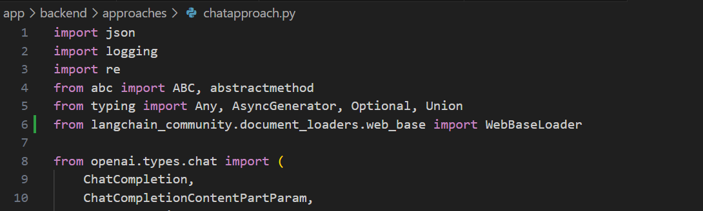

# How to start and discover this new app

> For facility reason, i have already created this app in Azure in a dedicate resource group ( during the class i can give you the access to it, but you could also create it by yourself by following the tutorial

> This app is a web app with a python backend.


You could find the code of the app in the folder and the tutorial by yourself or by a technical person with this link [App code](https://aka.ms/ragchat)

> Don't forget, great product with great feature have to be well architectured ( software and deployemnt) , be correctly advised and helped with right person with the skill level of your project/ ambitions :)

## Discover the app

### Architecture


This app is available in three languages [python, Java,Javascript and dotnet](https://github.com/Azure-Samples/azure-search-openai-demo/blob/main/docs/other_samples.md)
I'll stick in python for this tutorial to be more efficient and to avoid confusion with the notebook/Code you have already developed.

If you want to deepdive the code and documentation, you could follow this link [Docs Azure search demo](https://github.com/Azure-Samples/azure-search-openai-demo/tree/main/docs)
So you have deployed this app and you have access to it, like this screenshot :


## Include your notebook code in the app

So you have correctly create your code in a python notebook and you want to include it in your application
First of all read this page, it will explain to you how the app is structured and how to include your code in it.
[Customize your app](https://github.com/Azure-Samples/azure-search-openai-demo/blob/main/docs/customization.md)
or [Add you own data files](https://github.com/Azure-Samples/azure-search-openai-demo/blob/main/docs/data_ingestion.md)

### Step 2 : Understanding your code 

As an example i will add this new cool feature GenAI in my app
Extract from the notebook ["Web article context from a url"](https://aka.ms/inseadGenAI-2)

> [NOTE] Remember we are loading the content of a web page to use it in our app. ( few shot style)

( it's like RAG on files but **on the fly**)

You have to be sure that the necessary library are loaded :
- Langchain

The others are already provided in the app.

Your code was more or less :
```python
#import the necessary library
import openai
from langchain.loader import WebBaseLoader

def askgpt4(question, usetext=True):
    """
    Ask with Open AI GPT4 model
    """
    if usetext:
        prompt = question + "\n" + text

    else:
        prompt = question

    response = ClientOpenAi.chat.completions.create(
        model=model,
        n=1,
        temperature=temperature, # 0 to 1 by  step of 0.1 - O for  deterministic result, 1 is very creative
        messages=[
            {"role": "system", "content": "You are a helpful AI assistant."},
            {"role": "user", "content": prompt},
        ],
    )

    return response.choices[0].message.content


url = "https://medium.com/microsoftazure/introducing-langchain-agents-e58674b1a657"

loader = WebBaseLoader(url)
docs = loader.load()
text = " ".join(doc.page_content for doc in docs)

answer = askgpt4("Can you summarize this article?", usetext=False)  # Modify the askgpt4 function call

print(answer)

```

A local function named `askgpt4` that use the `ClientOpenAi` to ask a question to the model and return the answer.
This was your code and now we have to adapt it for the app to be able to use it in the app. ( __and correctly code it__ in the style of the app)


### Step 3 : Include your code in the app

We will made some changes in different files of the app to include your code.

#### 3.1 Backend part 

Essentially the fact is a url is send to the chat have to be detect in the backend code to be process :

Modify the file :
- app\backend\approaches\chatapproach.py

First import the new library needed :


    
```python
from langchain.loader import WebBaseLoader
```

##### 3.1.1

**Mandatory** Add the library in the requirements.in file and update the requirements.txt file

When the app is deployed, the requirements.txt file is used to install the necessary library.
We use in our case langchain so we have to add it otherwise the app will **not work.**
Modify the file:
- app\backend\requirements.ini

```bash
cd .\app\backend\
python -m piptools compile
```
The requirements.txt will be updated with this new library.

Add functions helper to manage the process

```python
    def verify_search_url(self, query_text: str):

        url_pattern = re.compile(r'http[s]?://(?:[a-zA-Z]|[0-9]|[$-_@.&+]|[!*\\(\\),]|(?:%[0-9a-fA-F][0-9a-fA-F]))+')
        url_match = url_pattern.search(query_text)
        if url_match:
            return True
        
    def include_url_in_search_query(self, url: str):
        content = " "
        if( url ):
            loader = WebBaseLoader(url)
            docs = loader.load()
            content = "\n".join(doc.page_content for doc in docs)

        return content
```

Theses 2 functions have the role to detect if the query is a url and to include the content loaded ( by langchain) of the url in the query.

Now we have to modify function in the process business to call this new feature.

- app\backend\approaches\chatreadretrieveread.py

We will add a function used in Ai completion ( the tools item ) create to be called in case the model detect if there is the need of use this function

```python
      tools: List[ChatCompletionToolParam] = [
            {
                "type": "function",
                "function": {
                    "name": "search_sources",
                    "description": "Retrieve sources from the Azure AI Search index",
                    "parameters": {
                        "type": "object",
                        "properties": {
                            "search_query": {
                                "type": "string",
                                "description": "Query string to retrieve documents from azure search eg: 'Health care plan'",
                            }
                        },
                        "required": ["search_query"],
                    },
                },
                "type": "function",
                "function": {
                    "name": "search_url",
                    "description": "Retrieve sources from an url from a user",
                    "parameters": {
                        "type": "object",
                        "properties": {
                            "url_query": {
                                "type": "string",
                                "description": "URL to retrieve documents from eg: 'https://www.example.com'",
                            }
                        }
                    },
                    "required" : ["url_query"],
                },
            }
        ]
```	
We can also modify a little bit the prompt system to take in account this new possibility

> 'the user could give your an url for context and you will load this for context. Be brief in your answers.'


And lastly manage the call of the function in the process, the new if the if statement to verify if a url was detected and the call of the function to include the content of the url in the query.
after the else was the "old" code for semantic search in documents and we will keep it ( RAG files and vector)

```python
        if ( verify_search_url(query_text) == True):
        # If the query text is a search url, then we need to use the search_url tool and include it in the chat_completion
        search_url = query_text
        content = await self.include_url_in_search_query(search_url)

        # STEP 2: Retrieve relevant documents from the search index with the GPT optimized query

        else :
            # If retrieval mode includes vectors, compute an embedding for the query
            vectors: list[VectorQuery] = []
            if has_vector:
                vectors.append(await self.compute_text_embedding(query_text))

            # Only keep the text query if the retrieval mode uses text, otherwise drop it
            if not has_text:
                query_text = None

            results = await self.search(top, query_text, filter, vectors, use_semantic_ranker, use_semantic_captions)

            sources_content = self.get_sources_content(results, use_semantic_captions, use_image_citation=False)
            content = "\n".join(sources_content)
```

### Step 4 : Deploy your app with this new code

In your terminal console Visual studio code, You could now deploy your new code in your ressource group in Azure.


```bash
azd deploy
```

At the end of the deployment, you will have the url of your app and you could test it with the new feature.


