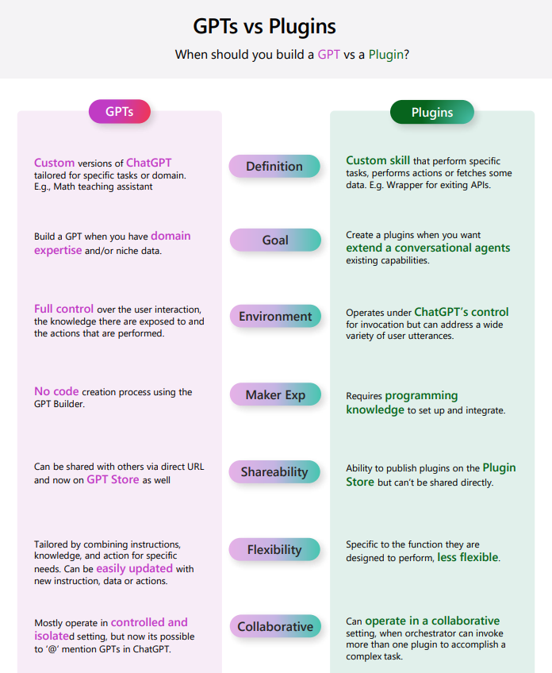

## Glossary AI

1. **LLM / MODELS**: Stands for Large Language Models. These are AI models trained on a large amount of text data. They can generate human-like text based on the input they're given.
You can read this page [MODELS](./MODELS.md)

    1.1 **SLM**: Stands for Small Language Models. These are AI models trained on a smaller amount of text data than LLMs. They can generate human-like text based on the input they're given.
    Usually small models ( like 2B or 7B) cost less in inference and training time, but they have less capabilities than LLMs (like GPT-3 or GPT-4) => could challenge in certains usecase the capabilities of the LLMs.

2. **Prompt engineering**: The practice of crafting effective prompts to get the desired output from a language model. It's a crucial part of working with models to ground of make a prompt system coherent and efficient for the response on your chatbot.

3. **Tokens**: In the context of language models, a token can be as short as one character or as long as one word (e.g., 'a', 'apple'). Models read text in chunks called tokens. as an example 1 token represents 4 characters.
Depending on the language used, the number of tokens can vary. For example, in English, the word "apple" is one token, but in Chinese, each character is a token.

4. **RAG**: Stands for Retrieval-Augmented Generation. It's a method that combines the benefits of retriever models (which retrieve information from a document collection) and generator models (which generate text).

5. **Embeddings**: In machine learning, embeddings are a type of representation that captures the semantic meaning of objects like words or items in a lower-dimensional space.

6. **Models**: In AI, a model is a specific representation learned from data by applying some machine learning algorithm. A model is used to make predictions on new data.

7. **Text 2 image**: Refers to AI models that can generate images from textual descriptions, such as DALL-E from OpenAI.

8. **Speech to text**: Refers to technology that can convert spoken language into written text. This is useful for transcription services, voice assistants, and more.

9. **Text to speech**: Refers to technology that can convert written text into spoken language. This is useful for voice assistants, audiobooks, and more.

10. **plugins** : In OpenAI's GPT-3, a plugin is a way to add custom functionality to the model. Plugins can be used to extend the model's capabilities and tailor it to specific tasks.

11. **GPT's** : Marketplace in OpenAi sandbox for custom Chatbot with plugins, task and connections

12. **AOAI** : Stands for Azure OpenAI. It's a collaboration between Microsoft and OpenAI to bring AI capabilities to Azure's cloud platform.

## How to choose between Gpt's of plugins

